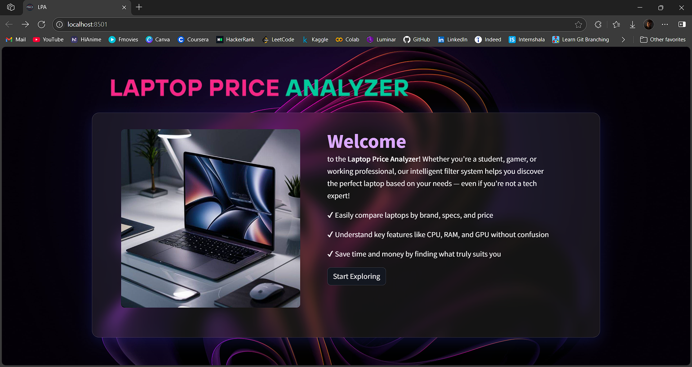
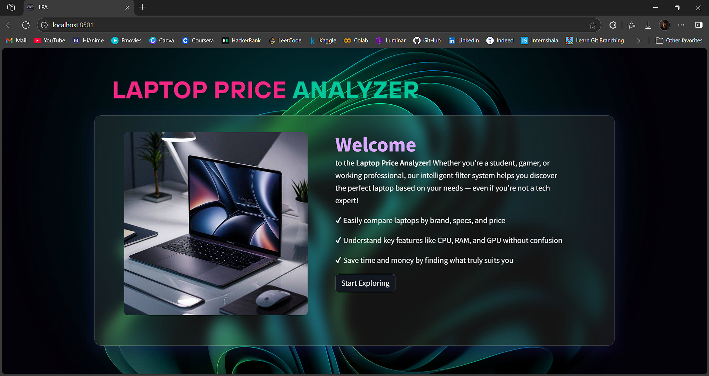

# 💻 Laptop Price Analyzer App

An interactive web app built using **Streamlit** to explore and analyze laptop prices based on features and specifications.

Built with 🐍 **Python**, 🧮 **Pandas**, 📊 **EDA**, and deployed using 🌐 **Streamlit Cloud**.  
Developed from insights gained during my **Exploratory Data Analysis (EDA)** of the [Laptop Price Dataset on Kaggle](https://www.kaggle.com/datasets/muhammadadiltariq/laptop-prices).

---

## 🌐 Live Demo

🔗 [Try the app now](https://laptop-price-analyzer-app.streamlit.app/)

---

## 📷 Demo Screenshots

  


---

## 🚀 Features

- 🔍 Interactive filtering by brand, CPU, RAM, GPU, and more  
- 🧊 Glassmorphic modern UI with smooth navigation  
- 📊 Real-time laptop display based on user inputs  
- 💡 Smart suggestions when no exact match is found  
- 📑 Multi-page layout for better user experience  
- 💡 Helpful messages and fallbacks when filters return no results

---

## 📦 Tech Stack

- **Python**  
- **Pandas**  
- **Streamlit**  
- **CSS** (Custom Styling)

---

## ▶️ How to Run Locally

```bash
git clone https://github.com/Vaisakh-Nirupam/Laptop_Price_Analyzer_App.git
cd Laptop_Price_Analyzer_App
pip install -r requirements.txt
streamlit run app.py